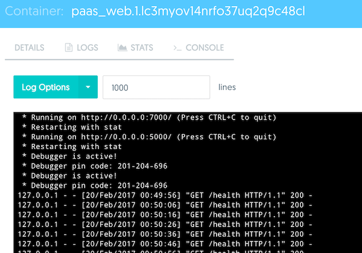
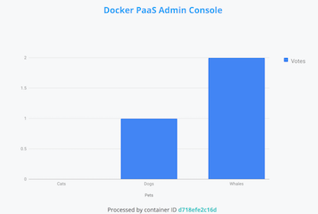
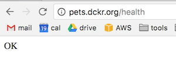

# Lab X: Deploying Applications with Docker Enterprise

In this lab you will deploy an application on UCP that takes advantage of some of the latest features of Docker Datacenter. The tutorial will lead you through building a compose file that can deploy a full application on UCP in one click. Capabilities that you will use in this application deployment include:

- Docker services
- Application scaling and failure mitigation
- Layer 7 load balancing
- Overlay networking
- Application secrets
- Application health checks
- RBAC-based control and visibility with teams

> **Difficulty**: Intermediate

> **Time**: Approximately 45 minutes

> **Tasks**:
>
> * [Prerequisites](#prerequisites)
> * [Deploying an Application](#task1)
> * [Task 2](#task2)

## Document conventions

When you encounter a phrase in between `<` and `>`  you are meant to substitute in a different value. 

For instance if you see `ssh <username>@<hostname>` you would actually type something like `ssh labuser@v111node0-adaflds023asdf-23423kjl.appnet.com`

You will be asked to SSH into various nodes. These nodes are referred to as **v111node0**, **v111node1** etc. These tags correspond to the very beginning of the hostnames you will find in your welcome email. 

## <a name="prerequisites"></a>Prerequisites

This lab is best done on three separate nodes, though it can be done with a single one. The requirements are as follows:

- 3 Nodes
- Docker Enterprise 17.03+ each installed on each
- 1 node as a UCP Manager node
- Remaining nodes as UCP Worker nodes


## <a name="Task 1"></a>Installing UCP
The following task will guide you through how to create a UCP cluster on your hosts.

### <a name="Task 1a"></a>Installing the UCP Manager


1. Log in to one of your hosts.

```
$ ssh -i <indentity file> ubuntu@<ducp-0 public ip>
```

2. Check to make sure you are running the correct Docker version. At a minimum you should be running `17.03.x EE`

```
$ docker version
Client:
 Version:      17.03.0-ee-1
 API version:  1.26
 Go version:   go1.7.5
 Git commit:   9094a76
 Built:        Wed Mar  1 01:20:54 2017
 OS/Arch:      linux/amd64

Server:
 Version:      17.03.0-ee-1
 API version:  1.26 (minimum version 1.12)
 Go version:   go1.7.5
 Git commit:   9094a76
 Built:        Wed Mar  1 01:20:54 2017
 OS/Arch:      linux/amd64
 Experimental: false
 
```

3. Run the UCP installer to install the UCP Controller node.

You will have to supply the following values to the install command:
- `--ucp-password` - This can be a password of your choosing
- `--san` - Supply the public IP address of this host. This will be the IP address you used to initially log in to this host in step 1.

```
docker run --rm -it --name ucp \
-v /var/run/docker.sock:/var/run/docker.sock \
-v ~/docker_subscription.lic:/docker_subscription.lic \
docker/ucp:2.1.1 install \
--admin-username admin \
--admin-password <your-password> \
--san <host-public-ip> \
--host-address $(hostname -i)
```

It will take up to 30 seconds to install.

4. Log in to UCP.

Now go to your browser and type in the public IP of this host in the address bar. You should be redirected to a login page. Log in as the user `admin` with the password that you supplied in step 3.

TODO picture

You now have a UCP cluster with a single node. Next you are going to add two nodes to the cluster. These nodes are known as Worker nodes and are the nodes that host application containers. 

5. In the UCP GUI, click through to Resources / Nodes. Click "+ Add Node" and then click "Copy to Clipboard."

The string you copied will look something like the following:

```
docker swarm join --token SWMTKN-1-5mql67at3mftfxdhoelmufv0f50id358xyyeps4gk9odgxfoym-4nqy2vbs5gzi1yhydhn20nh33 172.31.24.143:2377
```

This is a Swarm join token. It is a secret token used by nodes so that they can securely join the rest of the UCP cluster.
 
6. Log in to one of your remaining nodes. On the command line run the Swarm join token command you copied from UCP. You will get a status message indicating that this node has joined the cluster.

```
$ docker swarm join \
>     --token SWMTKN-1-1dg967kx56j9s0l0o8t8oytwutacsspzjt6f2h2i31s3cevmcm-7tihlxtl2e2uztmxjhtgs5orz \
>     172.31.30.254:2377
This node joined a swarm as a worker.
```

This indicates that this node is now joining your UCP cluster.

7. Repeat step 6 for all of your remaining nodes.

8. Go to the UCP GUI and click on Resources / Nodes. You should now see that all of your nodes listed with their respective role as Manager or Worker.

Congratulations! You have succesfully installed and deployed a full UCP cluster. You are now ready to move on to the rest of the lab.

## <a name="Task 2"></a>Deploying a Simple Application

In this section we will deploy the first version of our application. TODO explanation of stacks, compose, services.

```
version: '3.1'
services:
    web:
        image: chrch/paas:1.1
        ports:
            - 5000
        healthcheck:
            interval: 10s
            timeout: 2s
            retries: 3   
```


**Goal:** Application Deployment Operations

* Deploy NGINX on application LB node (`dac-lb-2`) to be used to route application traffic to worker nodes
	* NGINX needs to listen on ports 80/443 and forward to standard HRM ports (80/443).
	*  Reconfigure `app-nginx.conf` config file available in this directory with your setup's info by substituting `MANAGER_IP` in the config file. Then launch the nginx container using `docker run -d -p 80:80 -p 443:443 --restart=unless-stopped --name app-lb -v ${PWD}/app-nginx.conf:/etc/nginx/nginx.conf:ro nginx:stable-alpine`
	* Deploy the Pets as a Service App as follows:

#### Environment Requirements
- Docker Engine 17.03 EE
- UCP 2.1.x
- Minimum 2x hosts
- 2x DNS names for pets.* and admin.pets.*
- Ports open for app


#### Configuring Secrets
- PaaS uses a secret to access the Admin Console so that votes can be viewed. Before we deploy Paas, the UCP administrator has to create a secret in UCP.  Adjust the [pets-prod-compose.yml](https://github.com/mark-church/docker-paas/blob/master/pets-prod-compose.yml) file so that it matches the name of your secret. The environment variable `ADMIN_PASSWORD_FILE` must match the location and name of your secret. The default in the compose file is `ADMIN_PASSWORD_FILE=/run/secrets/admin_password` if your secret is named `admin_password`. Use whatever secret you like. If your secret is named `mysecret` then the value of `ADMIN_PASSWORD_FILE` would be `/run/secrets/mysecret`.


#### Configuring HRM
- Configure the `pets-prod-compose.yml` with the correct HTTP Routing URLs. Replace `<pets-ip>` and `<admin-console-ip>` with the values `pets.app<team>.dac.dckr.org` and `admin.app<team>.dac.dckr.org`. Replace `<team>` with your team.

 

#### Deploying with Compose
- Now deploy the application with your compose file, [pets-prod-compose.yml](https://github.com/mark-church/docker-paas/blob/master/pets-prod-compose.yml) in UCP as a Docker stack.

- Check the stack's service status and the logs for the `web` service. It will take up to 30 seconds for the app to become operational. Try going to one of the ports or URLs that the app is running on. You will see the event in the `web` service.

 

#### Load Balancing 
- If DNS and HRM (L7 load balancing) are configured correctly you can access on the configured URL or the ephemeral port chosen by UCP. You can set your `/etc/hosts` file to provide the resolution for the URL set in the compose file.

 

- Access the PaaS client page. Input your name and vote for a specific animal.


 


- Reload the page to serve new animals by pressing `Serve Another Pet`. See that you are being load balanced between multiple containers. The container ID will switch between the number of container in the `web` service, illustrating the Docker Routing Mesh.

- Feel free to hit `Vote Again` if you wish to change your vote.

 

- Log in to the admin console using the URL or port exposed by UCP. Use the secret password specified in Step 1.

 

- Now view the votes!

 

#### Sticky Sessions
- You may have noticed that the voting page load balances across the web container IDs. When you go to the Admin console, you will notice that the container ID presented is the same every time. That is because UCP is using the `sticky_sessions` option of the L7 load balancer. 

- Try going to the port that is exposed by the Admin Console. The port can be found in the UCP GUI when clicking on the `web` service. Go to this port log in with your secret. Refresh the Admin Console page couple times and you should see the container ID changing. This is because you are accessing it through the L4 port which does not have `sticky_sessions` enabled.

#### Scaling and Deploying Application Instances
- View how the application has been scheduled across nodes with the "Swarm Visualizer." It's running as the `pets-viz` container and you can see what port it's exposed on in the UCP GUI.

 

- Scale the application by changing the replicas parameter for the `paas_web` service to `6`. In `pets-viz` we can see additional nodes get scheduled. Back in the application you can see that `Serve Another Pet` is now load balancing you to more containers.

 

- Now initiate a rolling deployment. For the `pets_web` service change the following paramaters and click `Save Changes`
   - Image `chrch/paas:1.1-broken`
   - Update Parallelism `1`
   - Update Delay `5`
   - Failure Action `Pause`
   - Max Failure Ratio `0.2` (20%)

- Look at the visualizer and you will see that the health checks never pass for this image. Watch for up to 30 seconds. Now go back to the UCP GUI and click on `pets_web`. You will see that the rollout has been paused because the rollout has passed the failure threshold of 20%. Now initiate a rolling deployment again, but this time use the image `chrch/paas:1.1b`

 

#### Managing the Application Lifecycle
- Check that the application health check is working by going to `/health`. This health check endpoint is advertising the health of the application. UCP uses this health metric to manage the lifecycle of services and will kill and reschedule applications that have been unhealthy.



- Toggle the health check to be unhealthy by going to `/kill`. This URL will make the `/health` endpoint of one of the `web` containers return `unhealthy`. Now return to the web browser to see that one of the containers has toggled to unhealthy. Continue to refresh and see what happens. The container will be killed and rescheduled by Swarm automatically. It will be replaced by a new `web` container.

 

- Now go to one of your worker nodes and kill the worker engine with `sudo service docker stop`. In the swarm visualizer you will see the node dissappear and the engines will be rescheduled on the remaining nodes.

# Lab 4

**Goal:** Install and configure highly available DTR

* Deploy HAPROXY on LB node for DTR (`dac-lb-1`)
	* HAPROXY needs to listen on ports 80/443 and forward to non-standard port of UCP. Please use port *12391* for HTTP and *12392* for  HTTPS.
	*  Reconfigure `dtr-haproxy.cfg` config file available in this directory with your setup's info by substituting `MANAGER_IP` in the config file. The launch the haproxy container using `docker run -d -p 443:443 -p 8181:8181 --restart=unless-stopped --name ucp-lb -v ${PWD}/dtr-haproxy.cfg:/usr/local/etc/haproxy/haproxy.cfg:ro haproxy:1.7-alpine haproxy -d -f /usr/local/etc/haproxy/haproxy.cfg`
* Install DTR Version `2.2.2`
	* Install three DTR replicas on the Manager nodes
	* Make sure to use correct external url. This should be your DTR's FQDN. 
	* Make sure to use non-standard ports *12391* for HTTP and *12392* for  HTTPS for **each** replica using the `--replica-http-port` and `--replica-https-port` flags.
* Configure external cert and confirm you can establish HTTPS using your browser.
* Configure Storage Backend.
	* Minio, an S3 Compatible Object storage, is configured already on the `dac-services` node. Please use the following configuration to set it up.
	* Go to $DAC_SERVICES_PUBLIC_IP>:9000
	* Create a Bucket (lower right corner) and call it `dtr`
	* Go back to DTR URL, and go to **Settings** > **Storage**.
	* Select S3 and provide the required parameters. Make sure to use your own `dac-services` private IP as the **Region Endpoint** Here's a sample configuration:
	
	* Confirm your configuration worked:
		* Create your first repository under the `admin` namespace.
		* Perform a `docker login` from your local Docker client.
		* Perform a docker push to confirm that storage backend is configured. 
* Set up Docker Security Scanning 
* Backup DTR
	* [Documentation](https://docs.docker.com/datacenter/dtr/2.2/guides/admin/backups-and-disaster-recovery/)
* Upgrade DTR to 2.2.3
* Redeploy the Pets App using images on DTR
	* Create the repos on DTR
	* Set up Docker Security Scanning for the images
	* Push the images to DTR
	* Redeploy the application by updating the images (`docker service update`)


* Finally, ensure that you have a fully functioning DTR cluster composed of three replicas, configured with proper external certs, object storage, and the Pets app is deployed using DTR-based images.


