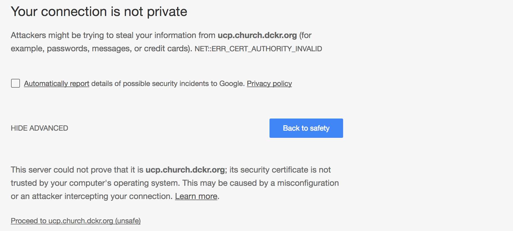
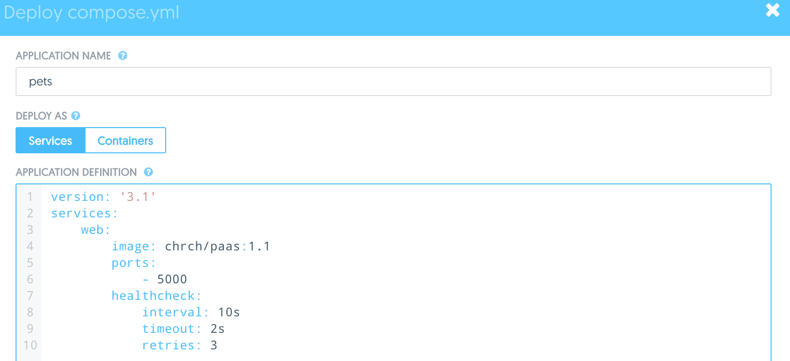
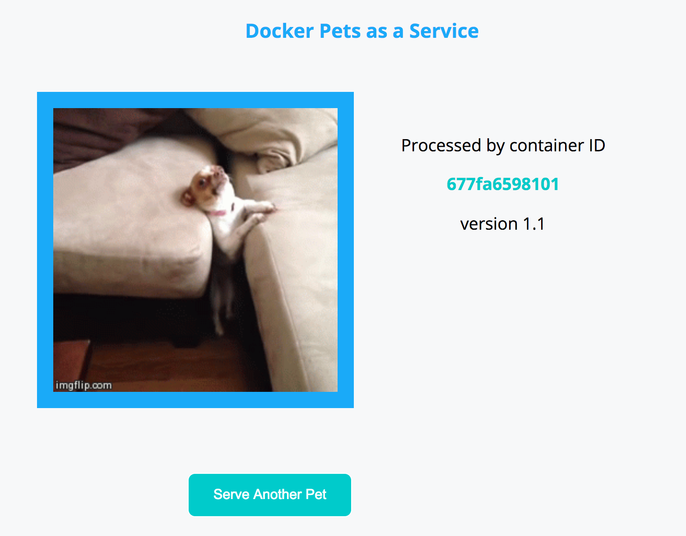
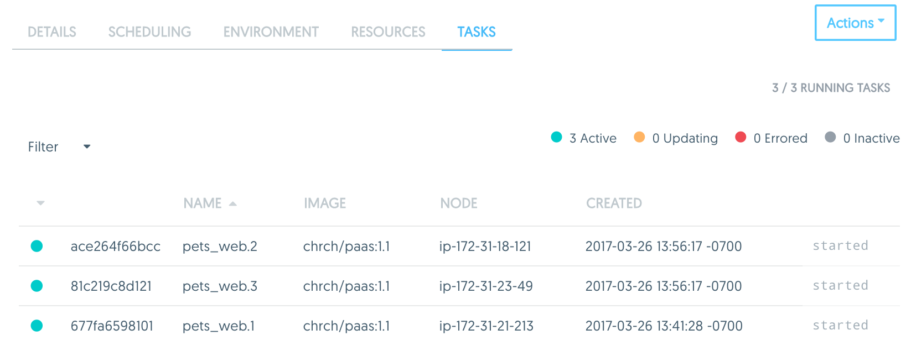
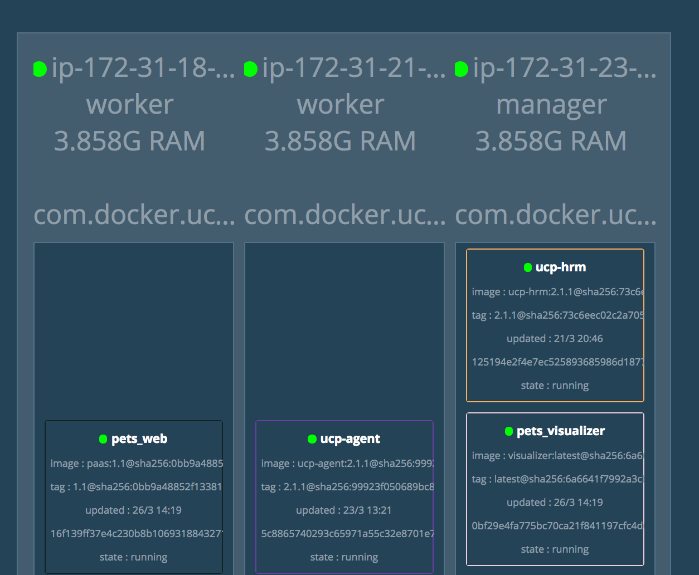
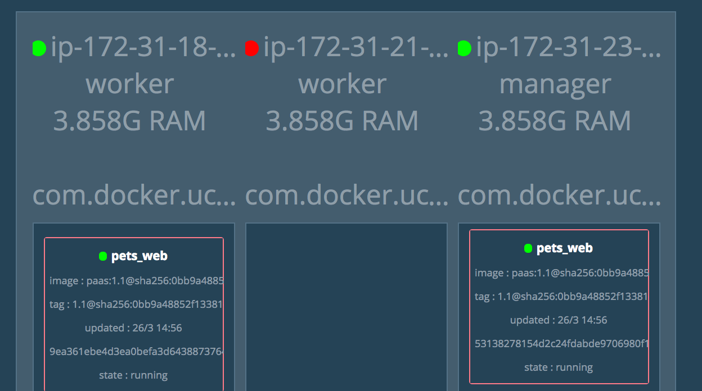
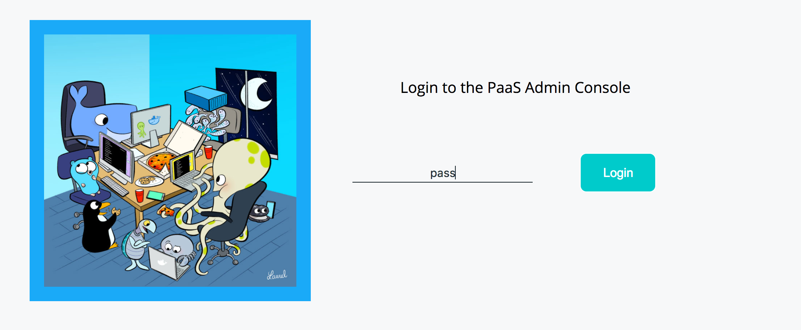
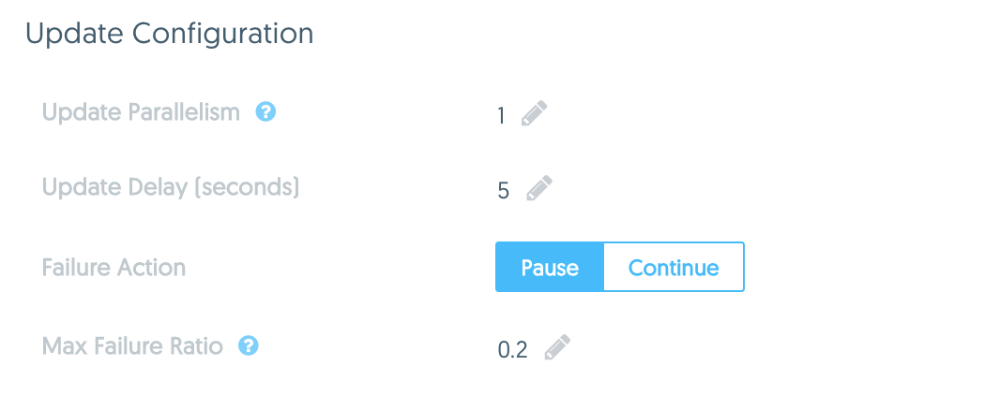
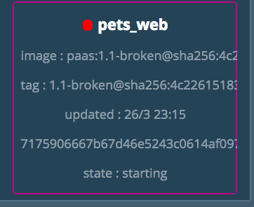
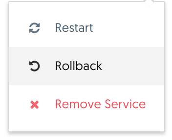

# Lab X: Deploying Applications with Docker Enterprise

In this lab you will deploy an application on UCP that takes advantage of some of the latest features of Docker Datacenter. The tutorial will lead you through building a compose file that can deploy a full application on UCP in one click. Capabilities that you will use in this application deployment include:

- Docker services
- Application scaling and failure mitigation
- Layer 7 load balancing
- Overlay networking
- Application secrets
- Application health checks
- RBAC-based control and visibility with teams

> **Difficulty**: Intermediate

> **Time**: Approximately 50 minutes


> **Tasks**:
>
> * [Prerequisites](#prerequisites)
> * [Task 1: Installing UCP](#task1)
>   * [Task 1.1: Installing the UCP Manager](#task1.1)
>   * [Task 1.2: Joining UCP Worker Nodes](#task1.2)
> * [Task 2: Deploying a Simple Application with Compose](#task2)
>   * [Task 2.1: Okay, Let's Deploy!](#task2.1)
>   * [Task 2.2: Scaling Services](#task2.2)
>   * [Task 2.3: Deploying the Visualizer App](#task2.3)
>   * [Task 2.4: Self-Healing Applications](#task2.4)
> * [Task 3: Deploying a Complex Multi-Service Application](#task3)
>   * [Task 3.1: Deploying a Stateful Service ](#task3.1)
>   * [Task 3.2: Configuring Application Secrets](#task3.2)
>   * [Task 3.3: Using Healthchecks to Control Application Lifecycle](#task3.3)
>   * [Task 3.4: Upgrading with a Rolling Update](#task3.4)

## Document conventions

When you encounter a phrase in between `<` and `>`  you are meant to substitute in a different value. 

For instance if you see `ssh <username>@<hostname>` you would actually type something like `ssh labuser@v111node0-adaflds023asdf-23423kjl.appnet.com`

You will be asked to SSH into various nodes. These nodes are referred to as **v111node0**, **v111node1** etc. These tags correspond to the very beginning of the hostnames you will find in your welcome email. 

## <a name="prerequisites"></a>Prerequisites

This lab is best done on three separate nodes, though it can be done with a single one. The requirements are as follows:

- 3 Nodes
- Docker Enterprise 17.03+ each installed on each
- 1 node as a UCP Manager node
- Remaining nodes as UCP Worker nodes


## <a name="task1"></a>Task 1: Installing UCP
The following task will guide you through how to create a UCP cluster on your hosts.

### <a name="task1.1"></a>Task 1.1: Installing the UCP Manager


1. Log in to `node0` of the three nodes you have been given for this lab. We will install `node0` as the UCP controller of your UCP cluster.

```
$ ssh ubuntu@<node0-public-dns>
```

2. Check to make sure you are running the correct Docker version. At a minimum you should be running `17.03 EE`

```
$ docker version
Client:
 Version:      17.03.0-ee-1
 API version:  1.26
 Go version:   go1.7.5
 Git commit:   9094a76
 Built:        Wed Mar  1 01:20:54 2017
 OS/Arch:      linux/amd64

Server:
 Version:      17.03.0-ee-1
 API version:  1.26 (minimum version 1.12)
 Go version:   go1.7.5
 Git commit:   9094a76
 Built:        Wed Mar  1 01:20:54 2017
 OS/Arch:      linux/amd64
 Experimental: false
 
```

3. Run the UCP installer to install the UCP Controller node.

You will have to supply the following values to the install command:
- `--ucp-password` - This can be a password of your choosing
- `--san` - This should be the public IP of `node0`

```
docker run --rm -it --name ucp \
-v /var/run/docker.sock:/var/run/docker.sock \
-v ~/docker_subscription.lic:/docker_subscription.lic \
docker/ucp:2.1.1 install \
--admin-username admin \
--admin-password <your-password> \
--san <node0-public-dns> \
--host-address $(hostname -i)
```

It will take up to 30 seconds to install.

4. Log in to UCP by going to `https://<node0-public-dns>` in your browswer

Depending on what browser you are using, you will receive a warning about the connection. Proceed through to the UCP URL. The warning is occuring because we UCP uses privately signed certificates by default. In a production installation we would add our own certificates that would be trusted by our browser.

 

Log in as the user `admin` with the password that you supplied in step 3.

 

You now have a UCP cluster with a single node. Next you are going to add two nodes to the cluster. These nodes are known as Worker nodes and are the nodes that host application containers. 

### <a name="Task 1.2"></a>Task 1.2: Joining UCP Worker Nodes


1. In the UCP GUI, click through to Resources / Nodes. Click "+ Add Node" and then click "Copy to Clipboard."

The string you copied will look something like the following:

```
docker swarm join --token SWMTKN-1-5mql67at3mftfxdhoelmufv0f50id358xyyeps4gk9odgxfoym-4nqy2vbs5gzi1yhydhn20nh33 172.31.24.143:2377
```

This is a Swarm join token. It is a secret token used by nodes so that they can securely join the rest of the UCP cluster.
 
2. Log in to one of your remaining nodes. On the command line run the Swarm join token command you copied from UCP. You will get a status message indicating that this node has joined the cluster.

```
$ docker swarm join \
>     --token SWMTKN-1-1dg967kx56j9s0l0o8t8oytwutacsspzjt6f2h2i31s3cevmcm-7tihlxtl2e2uztmxjhtgs5orz \
>     172.31.30.254:2377
This node joined a swarm as a worker.
```

This indicates that this node is now joining your UCP cluster.

3. Repeat steps 1 & 2 for all of your remaining nodes.

4. Go to the UCP GUI and click on Resources / Nodes. You should now see that all of your nodes listed with their respective role as Manager or Worker.

Congratulations! You have successfully installed and deployed a full UCP cluster. You are now ready to move on to the rest of the lab.

## <a name="Task 2"></a>Task 2: Deploying a Simple Application with Compose

### <a name="compose"></a>Docker Compose Files
Compose is a specification for defining and running multi-container Docker applications. With compose, you use a compose file to configure your application’s services. Then, using a single command, you create and start all the services from your configuration. A single compose file can define all aspects of your application deployment including networking, health checks, secrets, and much more. The full specification for compose is defined [here](https://docs.docker.com/compose/compose-file/).

### <a name="stack"></a>Docker Services and Stacks

To deploy an application on UCP or Swarm, you create a [service](https://docs.docker.com/engine/swarm/how-swarm-mode-works/services/). Frequently a service will be the image for a microservice within the context of some larger application. Examples of services might include an HTTP server, a database, or any other type of executable program that you wish to run in a distributed environment. UCP schedules services across a cluster of UCP worker nodes. Services are managed by UCP throughout their lifecycle and can get rescheduled if they die, scaled up and down, gracefully terminated and more.

A [Docker Stack](https://docs.docker.com/engine/reference/commandline/stack_deploy/#related-commands) is an instantiation of a compose file. When a compose file is deployed on UCP it is deployed as a stack. This stack is a group of related services (applications) that can be defined and deployed together in a single compose file.

In this section we will deploy the [Docker Pets](https://github.com/mark-church/docker-paas) application using a compose file. In the following sections we will add features to our compose file and make our application progressively more complex and feature-full. Docker Pets is a simple web app that records votes for different animals and uses a persistent backend to record the votes. It's comprised of two images:

- **`chrch/docker-pets`** is a front-end Python Flask container that serves up random images of housepets, depending on the given configuration
- **`consul`** is a back-end KV store that stores the number of visits that the web services recieve. It's configured to bootstrap itself with 3 replicas so that we have fault tolerant persistence.

This is the first iteration of our compose file for the Docker Pets application:

```
version: '3.1'
services:
    web:
        image: chrch/docker-pets:latest
        ports:
            - 5000
        healthcheck:
            interval: 10s
            timeout: 2s
            retries: 3   
```

- `version: '3.1'` is the version of the compose format we are using.
- `web:` is the name that we are giving this service.
- `image: chrch/docker-pets:1.1` defines the image and version that we are deploying in this service.
- `ports:` configures the ports that we expose for our application. Our application listens on port `5000` so we are exposing port `5000` internally and mapping it to a random ephemeral port externally. UCP will take care of the port mapping and application load balancing for us.
- `healthcheck:` defines the health check for our application. We are setting the `interval` for how often the check runs and how many `timeouts` we allow before we consider the container to be unhealthy.

### <a name="task2.1"></a>Task 2.1: Okay, Let's Deploy!

1. Log in to your UCP GUI and go to Resources / Stacks & Applications / Deploy. Paste the above compose file text into the box under Application Definition. In the Application Name box write `pets`. Click the Create button.

 

You should see a success message:

```
Creating network pets_default
Creating service pets_web
```

Your `pets` application stack is now deployed and live! It's running as a single stateless container and serving up a web page. 

2. Go to Resources and click on the stack that you just deployed. You will see that we deployed a service called `pets_web` and a network called `pets_default`. Click on the `pets_web` service and you will see all of the configured options for this service. Some of these are taken from our compose file and some are default options.

 

3. Go to Resources / Networks and you will see that a new overlay network called `pets_default` now exists.

4. On the bottom of the `pets_web` page, UCP will show what ports it is exposing the application on. In your browser go to the public IP of one of your worker nodes and the port that is listed `<public-ip>:<published-port>`.

 

In your browser you should now see the deployed Docker Pets app. It serves up an image of different pets. Click on "Serve Another Pet" and it will reload the picture.

 

### <a name="task2.2"></a>Task 2.2: Scaling Services

So far we have deployed a service as a single container. Our application will need some level of redundancy in case there is a crash or node failure, so we are going to scale the `web` service so that it's made of multiple containers running on different hosts.

1. Go to Resources / Services / `pets_web`/ Scheduling. Edit the Scale parameter and change it from `1` to `3`. Click the checkmark and then Save Changes. After a few moments on the Services page we can see that the Status will change to `3/3` as the new container is scheduled and deployed in the cluster. Click on `pets_web` / Tasks. It shows the nodes where our `web` containers were deployed on. 

 

2. Now go back to the application `<public-ip>:<published-port>` in your browser. Click Server Another Pet a few times to see the page get reloaded. You should see the Container ID changing between three different values. UCP is automatically load balancing your requests between the three containers in the `pets_web` service.

### <a name="task2.3"></a>Task 2.3: Deploying the Visualizer App

Now we are going to deploy a second service along with our Docker Pets application. It's called the Visualizer and it visually shows how containers are scheduled across a UCP cluster.

Now we are going to update the `pets` stack with the following compose file. We have added a couple things to this compose file.

```
version: '3.1'
services:
    web:
        image: chrch/docker-pets:latest
        deploy:
            replicas: 3
        ports:
            - 5000
        healthcheck:
            interval: 10s
            timeout: 2s
            retries: 3   
            
    visualizer:
        image: manomarks/visualizer
        ports:
            - 8080
        deploy:
            placement:
                constraints: [node.role == manager]
        volumes:
            - /var/run/docker.sock:/var/run/docker.sock
```

- `replicas: 3` defines how many identical copies of a service container we want UCP to schedule. 
- `visualizer:` is a second service we are going deploy as a part of this stack. 
- `constraints: [node.role == manager]` is a scheduling requirement we are applying so that the `visualizer` is only scheduled on the manager node.
- `- /var/run/docker.sock:/var/run/docker.sock` is a host-mounted volume we are mounting inside our container. This volume is being used so that the `visualizer` can communicate directly with the local docker engine.

1. Go to Resources / Stacks & Applications / Deploy. Paste the above compose file text into the box under Application Definition with the title `pets`. 

 

You should see the following output:

```
Updating service pets_web (id: vyp6gx092d1o6z7t2wy996i7u)
Creating service pets_visualizer
```

The `pets_visualizer` service is created and our existing `pets_web` service is updated. Because no `pets_web` parameters were changed in this compose file, there are no actions done to the `web` containers.

2. Go to the `<external-ip>:<port>` that is listed on the page of the 	`pets_visualizer` service in your browser window. This shows you the nodes of your UCP cluster and where containers are scheduled. You should see that the `pets_web` container is evenly distributed across your nodes.

 


### <a name="task2.4"></a>Task 2.4: Self-Healing Applications with UCP

Now that we have a redundant application that we can view with the Visualizer, we are going to simulate a failure to test UCP's ability to heal applications. We will shut off one of the Docker engines. This will simulate a node failure.

1. Bring the Visualizer app up in your browser. Make note of how the `pets` containers are scheduled across your hosts. They should be distributed equally across all hosts.

2. Log in to the commandline of one of your worker nodes (be sure not to do this to the manager node). Shut the Docker engine off with the following command.

```
$ sudo service docker stop
docker stop/waiting
```
This will turn off the Docker engine and bring down all of the containers on this host.

3. Now watch the visualizer app in your browser. You will see one of the nodes go red, indicating that UCP has detected a node failure. Any containers on this node will now get rescheduled on to other nodes. Since we defined it in our compose file with `replicas: 3`, UCP will ensure that we always have `3` copies of the `web` container running in our cluster.

 

4. Now return `ucp-worker-1` to a healthy state by turning the Docker engine on again.

```
$ sudo service docker start
docker start/running, process 22882
```

5. Finally, decommission this `pets` stack in the UCP GUI by clicking on `pets` / Actions / Remove Stack. Confirm the removal. You have just removed all of the containers and also the networks that were created when the stack was first deployed.

 


## <a name="task3"></a>Task 3: Deploying a Complex Multi-Service Application

In this task we are going to add another service to the stack. Up to this point the Docker Pets application was a set of stateless web servers. Now we are going to add a persistent backend that will enhance the functionality of the application. We will use `consul` as a redundant backend which will store persistent data for our app, distributed across a set of nodes.

The resulting application will have 3 `web` frontend containers and 3 `db` consul containers. A backend network will be deployed for secure communication between `web` and `db`. The app is exposing HTTP endpoints for different services on ports `5000` and `7000`. UCP will publish these ports on each node in the UCP cluster. Application traffic to any of the external ports will get load balanced to healthy containers.


 

### <a name="task3.1"></a>Task 3.1: Deploying a Stateful Service 

In this step we will deploy a new compose file that adds functionality on top of the previous compose files.

```
version: '3.1'
services:
    web:
        image: chrch/docker-pets:latest
        deploy:
            replicas: 3
        ports:
            - 5000
            - 7000
        healthcheck:
            interval: 10s
            timeout: 2s
            retries: 3
        environment:
            DB: 'db'
        networks:
        	  - backend
            
    db:
        image: consul:0.7.2
        command: agent -server -ui -client=0.0.0.0 -bootstrap-expect=3 -retry-join=db -retry-join=db -retry-join=db -retry-interval 5s
        deploy:
            replicas: 3
        ports:
            - 8500 
        environment:
            CONSUL_BIND_INTERFACE: 'eth2'
            CONSUL_LOCAL_CONFIG: '{"skip_leave_on_interrupt": true}'
        networks: 
            - backend
            
    visualizer:
        image: manomarks/visualizer
        ports:
            - 8080
        deploy:
            placement:
                constraints: [node.role == manager]
        volumes:
            - /var/run/docker.sock:/var/run/docker.sock
    
networks:
	 backend:
```

- `- 7000` is exposing a second port on our application. This port will serve traffic to administrate the app.
- `environment:` defines environment variables that are set inside the container. In this compose file we are setting `DB=db`. Our backend service is named `db` so we are passing in the service name to the front end `web` service. During operations, built-in Docker DNS will resolve the service name to the IPs of the service's containers.
- `image: consul:0.7.2` is the image and version for our backend data persistence store. We are deploying 3 replicas for a highly available backend.
- `command:` is passing a specific command line argument to the consul image.
- `networks: backend:` defines an overlay network that both `web` and `db` will connect to to communicate.

1. Deploy the `pets` stack again with the above compose file. 

2. Once all the service tasks are up go to the `web` service externally published `<ip>:<port>` that maps to the internal port `5000`. The Docker Pets app is written to take advantage of the stateful backend. Now it gives you the capability to cast a vote for your favorite pet. The vote will be stored by the `db` service along with the number of visits to the application.

3. Submit your name and vote to the app.

 

After you cast your vote you will get redirected back to the pets landing page. 

4. Refresh the page a few times with Server Another Pet. You will see the page views climb while you get served across all three `web` containers.

5. Now go to the `web` service externally published `<ip>:<port>` that maps to the internal port `7000`. This page totals the number of votes that are held in the `db` backend.

 

6. If you go to the `visualizer` service in your browser you will now see that a redundant Consul KV store is deployed on the Swarm. It's storing the votes for the application.

### <a name="task3.2"></a>Task 3.2: Configuring Application Secrets

Secrets are any data that an application uses that is sensitive in nature. Secrets can be PKI certificates, passwords, or even config files. UCP handles secrets as a special class of data. Docker secrets are encrypted them at rest, sent to containers through TLS, and are mounted inside containers in a memory-only file that is never stored on disk. 

Before we can configure our compose file to use a secret, we have to create the secret so it can be stored in the encrypted UCP key-value store. 

1. In the UCP GUI go to Resources / Secrets / +Create Secret. Name your secret `admin_password`. Enter the secret password of your choice and click Create.


 

This secret will now be stored encrypted in the UCP data store. When applications request access to it, the secret will be sent encrypted to the container and mounted in a memory-only file on the host.

2. Update the `pets` stack with the following compose file.

```
version: '3.1'
services:
    web:
        image: chrch/docker-pets:latest
        deploy:
            replicas: 3
        ports:
            - 5000
            - 7000
        healthcheck:
            interval: 10s
            timeout: 2s
            retries: 3
        environment:
            DB: 'db'
            ADMIN_PASSWORD_FILE: '/run/secrets/admin_password'
        networks:
        	  - backend
        secrets:
            - admin_password
            
    db:
        image: consul:0.7.2
        command: agent -server -ui -client=0.0.0.0 -bootstrap-expect=3 -retry-join=db -retry-join=db -retry-join=db -retry-interval 5s
        deploy:
            replicas: 3
        ports:
            - 8500 
        environment:
            CONSUL_BIND_INTERFACE: 'eth2'
            CONSUL_LOCAL_CONFIG: '{"skip_leave_on_interrupt": true}'
        networks: 
            - backend

            
    visualizer:
        image: manomarks/visualizer
        ports:
            - 8080
        deploy:
            placement:
                constraints: [node.role == manager]
        volumes:
            - /var/run/docker.sock:/var/run/docker.sock
    
networks:
	 backend:

secrets:
    admin_password:
        external: true
```

We have made two additions to this compose file:

- `ADMIN_PASSWORD_FILE:` is an environment variable that tells the `web` service that the secret will be stored at the location `/run/secrets/admin_password`
- `secrets: admin_password` references the secret that we created in UCP. UCP will send the secret to the `web` containers wherever they are scheduled.

3. Now go to the `<host-ip>:<port>` on the `pets_web` service that is mapped to the internal port `7000`. This is the administrator consul that displays the votes. It should be protected by a password now. Use the secret you entered as the `admin_password`.




### <a name="task3.3"></a>Task 3.3: Using Healthchecks to Control Application Lifecycle

The Docker Pets application is built with a `/health` endpoint to advertise it's own health on port `5000`. Docker uses this endpoint to manage the lifecycle of the application.

1. View the application health by going to `<host-ip>:<port>/health` in your browser. You can use the `ip` of any of your UCP nodes. The `port` must be the external port that publishes the internal port `5000`.

You should receive an `OK` message indicating that this particular container is healthy.

2. Now use your browser and go to the `<ip>:<port>/kill` URL. This will toggle the health to unhealthy for one of the `web` containers. 

You should receive a message similar to:
```
You have toggled web instance 87660acc389c to unhealthy
```

3. Go to the Visualizer in your browser. You will see the healthcheck on one of the containers go to red. After a few more moments UCP will kill the container and reschedule another one. A default grace period is applied to allow existing application traffic to drain from this container. This simulates an application failure that is recovered by UCP.


### <a name="task3.4"></a>Task 3.4: Upgrading with a Rolling Update

A rolling update is a deployment method to slowly and incrementally update a series of containers with a new version in a way that does not cause downtime for the entire application. One by one, UCP will update containers and check the application health for any issues. If the deployment begins to fail in any way, a rollback can be applied to return the app to the last known working configuration.

In the following steps we will update the `pets_web` service with a new image version. We will use a purposely broken image to simulate a bad deployment. 

1. Click on the `pets_web` service. On the Details page change the image to  `chrch/docker-pets:broken`. Make sure to click the green check so that the change is captured.

2. On the Scheduling page update the following values:
   - Update Parallelism `1`
   - Update Delay `5`
   - Failure Action `pause`
   - Max Failure Ratio `0.2` (%)



These values mean that during a rolling update, containers will be updated `1` container at a time `5` seconds apart. If more than `20%` of the new containers fail their health checks then UCP will `pause` the rollout and wait for administrator action.

3. The changes you made are now staged but have not yet been applied. Click Save Changes. This will start the rolling update.

4. Now view the Visualizer app in your browser. You will see that the `chrch/docker-pets:broken` image is rolled out to a single container but it fails to pass it's health check. The second `chrch/docker-pets:broken` container will start failing afterwards which will trigger the rolling update to pause.



5. In UCP, click on the `pets_web` service. You will see the status of the update is now paused because of a failed health check.


6. In the Details page of `pets_web` click Actions / Rollback. This will automatically rollback the `pets_web` service to the last working image.
 


7. Repeat step 1 but this time use the image `chrch/docker-pets:2.0`.

8. Repeat step 2 with the same values and click Save Changes.

9. Observe a successful rolling update in the Visualizer. You will start to see each container being updated with the new image and in good health. Now go to the `<host-ip>:<port>` that corresponds to the internal port `5000`. After a couple refreshes you should see that some of the containers have already updated.


### Congratulations, you have completed the lab!!

